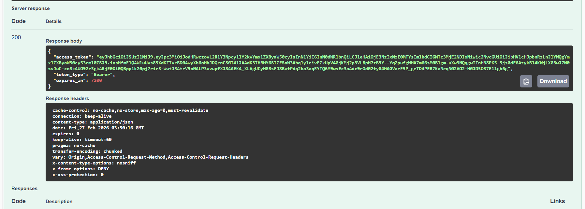
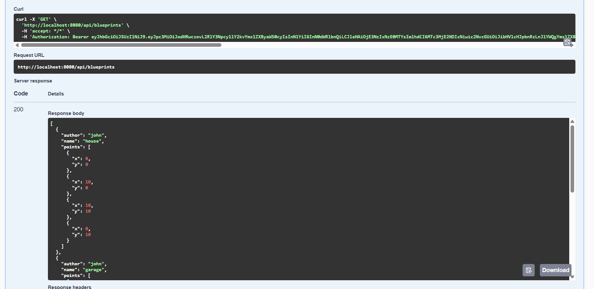
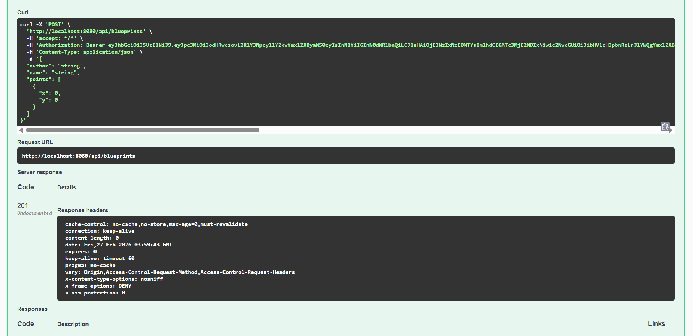
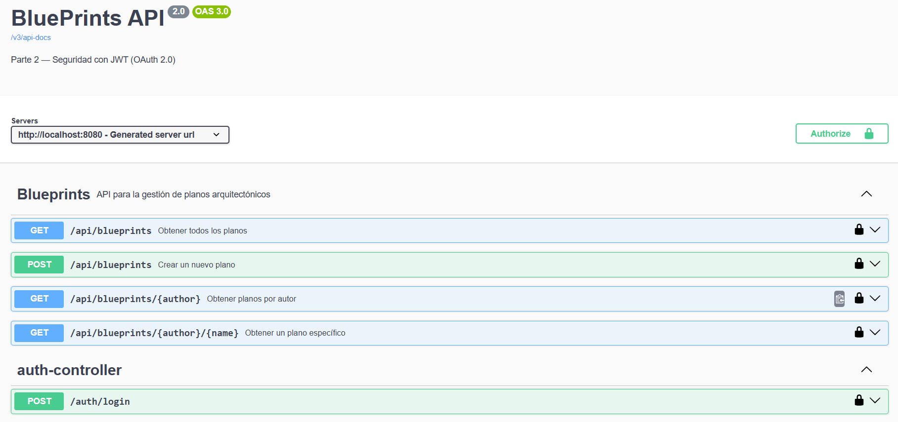

# Escuela Colombiana de Ingeniería Julio Garavito
## Arquitectura de Software – ARSW
### Laboratorio – Parte 2: BluePrints API con Seguridad JWT (OAuth 2.0)
### Autora: Raquel Selma
Este laboratorio extiende la **Parte 1** ([Lab_P1_BluePrints_Java21_API](https://github.com/DECSIS-ECI/Lab_P1_BluePrints_Java21_API)) agregando **seguridad a la API** usando **Spring Boot 3, Java 21 y JWT (OAuth 2.0)**.  
El API se convierte en un **Resource Server** protegido por tokens Bearer firmados con **RS256**.  
Incluye un endpoint didáctico `/auth/login` que emite el token para facilitar las pruebas.

---

## Objetivos
- Implementar seguridad en servicios REST usando **OAuth2 Resource Server**.
- Configurar emisión y validación de **JWT**.
- Proteger endpoints con **roles y scopes** (`blueprints.read`, `blueprints.write`).
- Integrar la documentación de seguridad en **Swagger/OpenAPI**.

---

## Requisitos
- JDK 21
- Maven 3.9+
- Git

---

## Ejecución del proyecto
1. Clonar o descomprimir el proyecto:
   ```bash
   git clone https://github.com/DECSIS-ECI/Lab_P2_BluePrints_Java21_API_Security_JWT.git
   cd Lab_P2_BluePrints_Java21_API_Security_JWT
   ```
   ó si el profesor entrega el `.zip`, descomprimirlo y entrar en la carpeta.

2. Ejecutar con Maven:
   ```bash
   mvn -q -DskipTests spring-boot:run
   ```

3. Verificar que la aplicación levante en `http://localhost:8080`.

---

## Endpoints principales

### 1. Login (emite token)
```
POST http://localhost:8080/auth/login
Content-Type: application/json

{
  "username": "student",
  "password": "student123"
}
```
Respuesta:
```json
{
  "access_token": "eyJhbGciOiJSUzI1NiIsInR5cCI6IkpXVCJ9...",
  "token_type": "Bearer",
  "expires_in": 3600
}
```

### 2. Consultar blueprints (requiere scope `blueprints.read`)
```
GET http://localhost:8080/api/blueprints
Authorization: Bearer <ACCESS_TOKEN>
```

### 3. Crear blueprint (requiere scope `blueprints.write`)
```
POST http://localhost:8080/api/blueprints
Authorization: Bearer <ACCESS_TOKEN>
Content-Type: application/json

{
  "name": "Nuevo Plano"
}
```

---

## Swagger UI
- URL: [http://localhost:8080/swagger-ui/index.html](http://localhost:8080/swagger-ui/index.html)
- Pulsa **Authorize**, ingresa el token en el formato:
  ```
  Bearer eyJhbGciOi...
  ```

---

## Estructura del proyecto
```
src/main/java/co/edu/eci/blueprints/
  ├── api/BlueprintController.java       # Endpoints protegidos
  ├── auth/AuthController.java           # Login didáctico para emitir tokens
  ├── config/OpenApiConfig.java          # Configuración Swagger + JWT
  └── security/
       ├── SecurityConfig.java
       ├── MethodSecurityConfig.java
       ├── JwtKeyProvider.java
       ├── InMemoryUserService.java
       └── RsaKeyProperties.java
src/main/resources/
  └── application.yml
```

---

## Actividades propuestas
1. Revisar el código de configuración de seguridad (`SecurityConfig`) e identificar cómo se definen los endpoints públicos y protegidos. 
2. Explorar el flujo de login y analizar las claims del JWT emitido. 
3. Extender los scopes (`blueprints.read`, `blueprints.write`) para controlar otros endpoints de la API, del laboratorio P1 trabajado. 
4. Modificar el tiempo de expiración del token y observar el efecto.
5. Documentar en Swagger los endpoints de autenticación y de negocio. 

---

## Mis Evidencias

### 1. Autenticación y Generación de Token
He realizado la petición al endpoint de login para validar mis credenciales. Aquí se puede observar cómo el sistema me devuelve el token JWT con el nuevo tiempo de expiración que configuré (7200 segundos).



### 2. Acceso a Recurso Protegido (Lectura)
Una vez obtenido mi token, realicé una consulta a la lista de planos. Validé que al incluir el token Bearer en el encabezado de mi petición, el sistema me permite visualizar todos los planos disponibles.



### 3. Validación de Seguridad y Scopes
Realicé una prueba intentando acceder a recursos o realizar acciones de escritura. Aquí evidencio cómo el servidor valida los scopes de mi token para permitir o denegar el acceso según mis permisos.



### 4. Documentación del API con Swagger
He personalizado la documentación de mis endpoints utilizando anotaciones de OpenAPI. En esta captura muestro cómo se visualiza mi API organizada y documentada en la interfaz de Swagger UI.



---

## Lecturas recomendadas
- [Spring Security Reference – OAuth2 Resource Server](https://docs.spring.io/spring-security/reference/servlet/oauth2/resource-server/index.html)
- [Spring Boot – Securing Web Applications](https://spring.io/guides/gs/securing-web/)
- [JSON Web Tokens – jwt.io](https://jwt.io/introduction)

---

## Licencia
Proyecto educativo con fines académicos – Escuela Colombiana de Ingeniería Julio Garavito.
