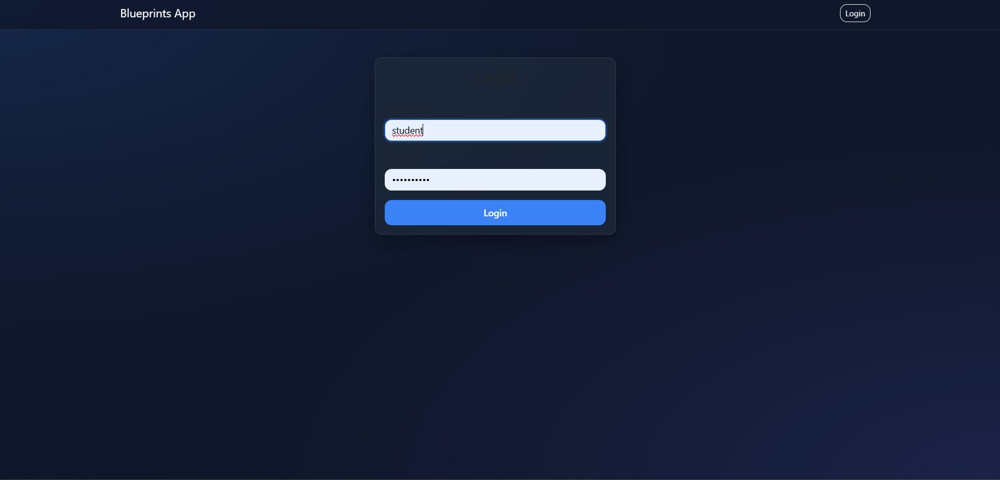
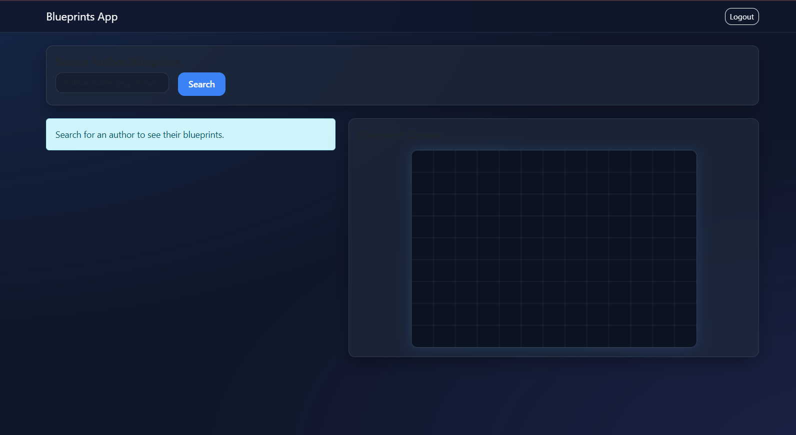
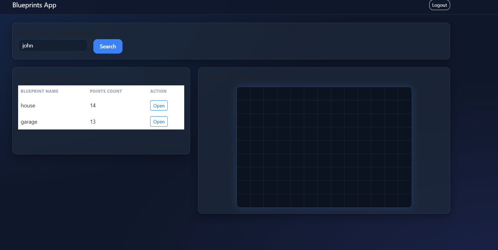
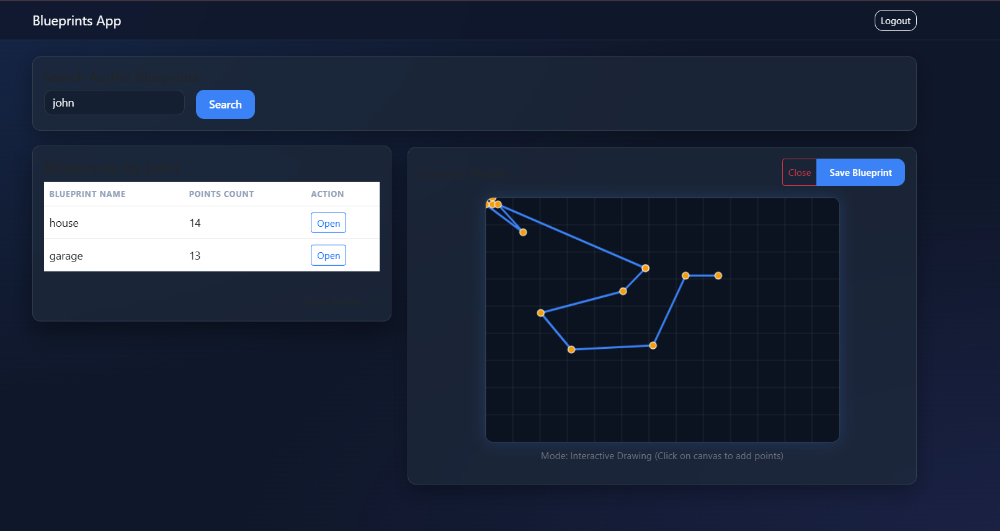
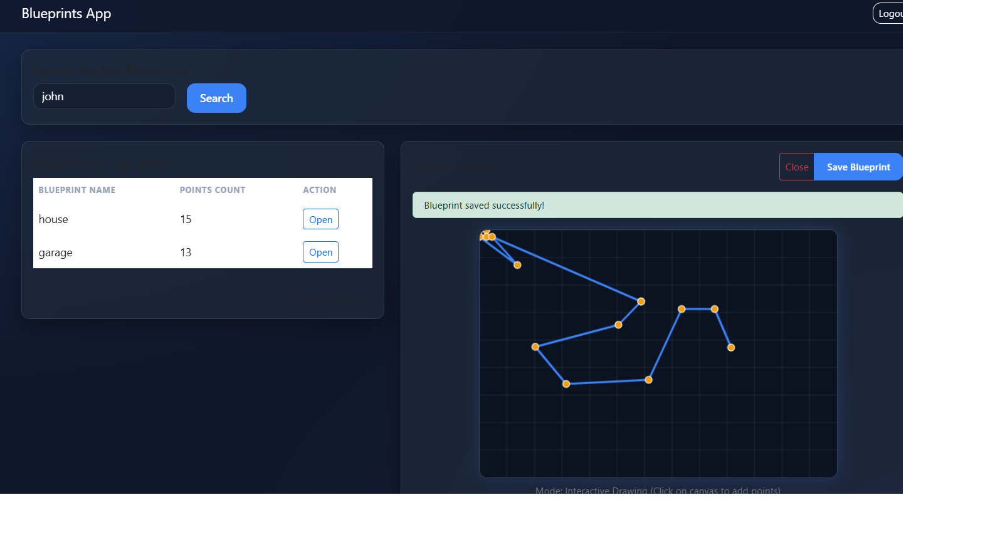
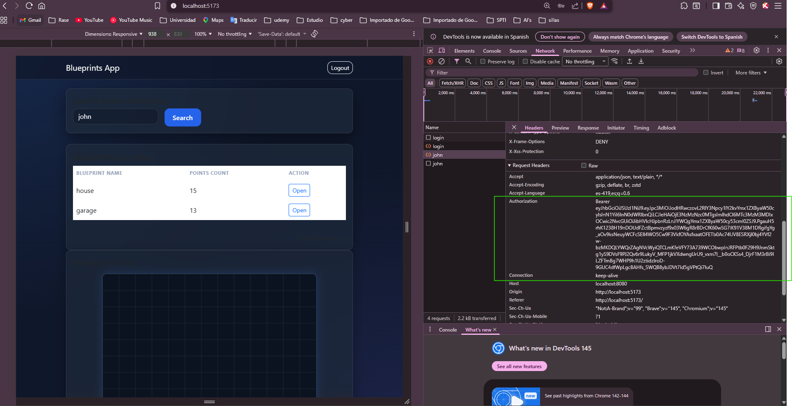
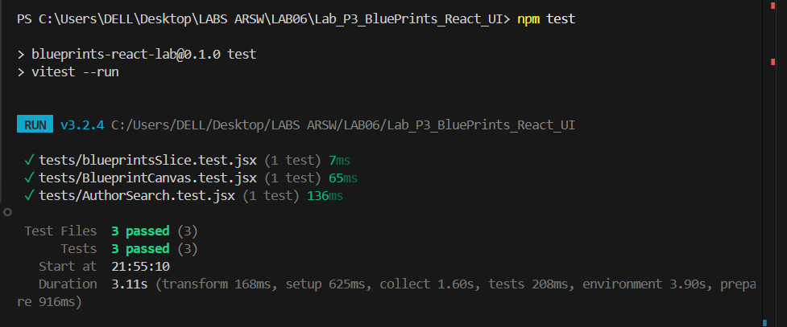
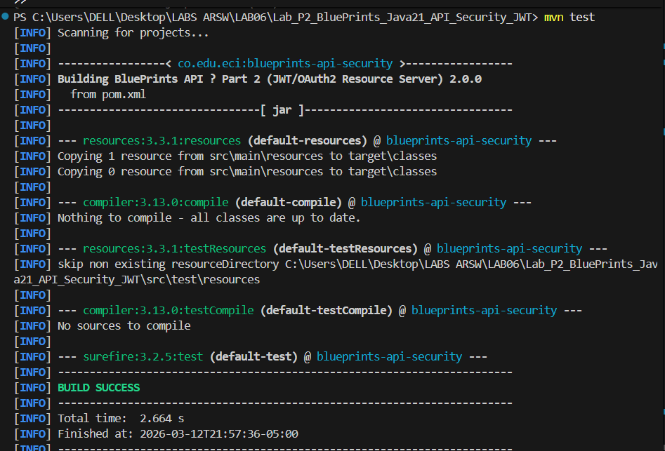

# Laboratorio 6: Arquitecturas de Software (ARSW)
##  Proyecto SPA de Blueprints - React + Spring Boot Security (JWT)

**Autor**: Raquel Selma  
**Institución**: Escuela Colombiana de Ingeniería Julio Garavito

---

##  Descripción delProyecto
He desarrollado este proyecto como una aplicación web moderna (SPA) para la gestión técnica de planos arquitectónicos. Mi implementación incluye:
- **Mi Backend**: Una API REST robusta construida con Java 21 y Spring Boot. He implementado seguridad basada en JWT y un sistema de persistencia en memoria para gestionar los datos.
- **Mi Frontend**: He creado un cliente web ágil con React y Vite. Utilizo Redux Toolkit para la gestión centralizada del estado y aprovecho la potencia del Canvas de HTML5 para el renderizado dinámico de los planos.

---

## Cómo se ejecuta el Proyecto

### 1. Iniciar el Backend (Java)
Para arrancar la API, entra a la carpeta del backend y ejecuta el siguiente comando:
```bash
cd Lab_P2_BluePrints_Java21_API_Security_JWT
# En Windows, usa mi wrapper:
.\mvnw spring-boot:run
# O si prefieres Maven global:
mvn spring-boot:run
```

### 2. Iniciar el Frontend (React)
Abre otra terminal para mi cliente web, entra a la carpeta e instala mis dependencias antes de iniciar el servidor de desarrollo:
```bash
cd Lab_P3_BluePrints_React_UI
npm install
npm run dev
```
Después, podrás ver mi aplicación en [http://localhost:5173](http://localhost:5173).

---

## 📸 Mis Evidencias (Pruebas de Funcionamiento)


### 1. Mi Sistema de Autenticación JWT
Aquí muestro cómo funciona mi formulario de login y el acceso exitoso que he configurado.




### 2. Mi Buscador y Listado de Planos
En esta imagen demuestro cómo mi buscador filtra resultados por autor (como `john`) y cómo mi tabla se actualiza dinámicamente.


### 3. Mi Canvas de Visualización y Dibujo Interactivo
Aquí presento mi lienzo de dibujo donde puedo visualizar un plano y añadir puntos nuevos en tiempo real haciendo clic con mi mouse.


### 4. Mi Proceso de Guardado 
He capturado el momento en que guardo mis cambios. Aquí se puede ver mi mensaje de éxito "Blueprint saved successfully!" tras interactuar con el botón "Save Blueprint".


### 5. Mi Seguridad de Capa de Red
Aquí evidencio que todas mis peticiones al servidor viajan seguras con el encabezado `Authorization: Bearer <TOKEN>` que he implementado.


### 6. Mis Pruebas Automatizadas
Para asegurar la calidad de mi código, he ejecutado tests tanto en el frontend como en el backend.
- **Frontend (Vitest)**: 
- **Backend (Junit)**: 

---

## Tecnologías Utilizadas
Para construir esta solución he utilizado:
- **Lenguajes**: Java 21, JavaScript (ES6+), HTML5, CSS3.
- **Frameworks**: Spring Boot 3.x para mi lógica de servidor y React 18 para mi interfaz de usuario.
- **Estado y API**: Redux Toolkit (mi almacén de datos) y Axios (mi cliente HTTP).
- **Seguridad**: He configurado Spring Security con JWT (Nimbus) para proteger mis datos.
- **Herramientas**: Maven para mi build de Java y Vite con npm para mi ecosistema de React.
- **Testing**: Valido mi trabajo con Vitest, Testing Library y Junit 5.
